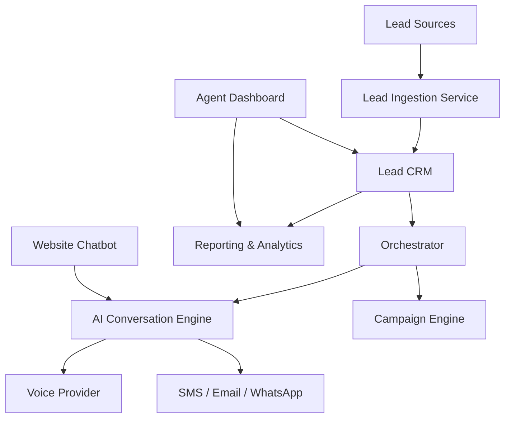

# Calling Agent — Architecture Overview

## 1. High-Level Stack Recommendation

| Layer | Technology |
|-------|------------|
| Frontend | Next.js 14 (App Router), TypeScript, Tailwind CSS, shadcn/ui |
| Backend API | Next.js API Routes + tRPC or REST |
| Database | PostgreSQL (via Prisma ORM) |
| Cache / Queues | Redis (BullMQ or Inngest) |
| AI / LLM | OpenAI GPT-4o / Claude via Vercel AI SDK |
| Voice | Vapi, Retell, or Bland (managed voice AI) |
| SMS | Twilio |
| Email | Resend or SendGrid |
| WhatsApp | Twilio WhatsApp Business API |
| Lead Import | Facebook Marketing API, Google Ads API |
| Auth | NextAuth.js or Clerk |
| File Storage | AWS S3 / Cloudflare R2 |
| Deployment | Vercel (frontend), Railway or Fly.io (workers) |

## 2. Core Domains

## 3. Key Data Models

- `Organization` — tenant / brokerage account
- `User` — agent, admin, ISA
- `Lead` — contact and qualification data
- `Conversation` — threads across channels
- `Message` — individual SMS/email/chat/voice transcript turn
- `Campaign` — nurturing sequences
- `CampaignStep` — scheduled actions
- `Integration` — connected services (Facebook, Google, MLS)
- `Listing` — property listings

## 4. Service Boundaries

1. **Ingestion Service** — receives webhooks from lead sources, deduplicates, enriches.
2. **Conversation Service** — maintains state, handles inbound/outbound messages.
3. **AI Orchestrator** — chooses response strategy, calls LLM, triggers tools.
4. **Campaign Service** — schedules and executes nurture sequences.
5. **Voice Service** — bridges to voice AI provider, handles calls and transfers.
6. **Reporting Service** — aggregates metrics for dashboards.

## 5. Scalability Notes
- Use Redis-backed queues for outbound campaign execution.
- Store call recordings and large transcripts in object storage.
- Separate voice worker processes from HTTP API for resilience.
- Multi-tenancy via `organizationId` on all tenant-scoped tables.
